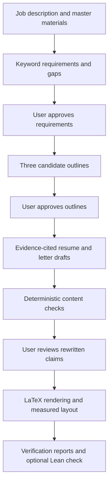

# ECC Scrubber

A Python CLI that turns a job description and your master resume into three tailored LaTeX resumes and accompanying cover letters. Codex or Claude Code handles drafting; Python controls the workflow, source checks, approvals, rendering, and verification.

**This was entirely vibe-coded** based on my proposed plan. My apologies for any bugs, I unfortunately don't have to write the code base myself. Just a reminder that since this uses an LLM backend, **do not upload anything you do not want OpenAI/Claude knowing**.


The project follows the plan in [scrubber.md](scrubber.md). Start with the architecture below to understand the design, or jump to [setup](#start) or the [CLI reference](#cli-reference) to run it.

## Architecture

The model proposes content; the Python harness decides whether that content satisfies the configured checks and has the required user approvals. Both backends feed the same workflow, so changing the model does not change the verification rules.

The framework chat is a guided sequence of prompts, drafting stages, and review steps. Each model call is a bounded subprocess invocation that returns structured JSON. Python owns the application files and renders the accepted content into LaTeX.

| Component | Responsibility |
| --- | --- |
| [cli.py](scrubber/cli.py) | Commands, user prompts, model selection, and starting or resuming sessions |
| [sources.py](scrubber/sources.py) | Document extraction, public listing retrieval, and detection of inaccessible or sign-in pages |
| [workflow.py](scrubber/workflow.py) | Stage sequencing, approval gates, corrective retries, and saved artifacts |
| [backend.py](scrubber/backend.py) | Codex and Claude Code subprocess adapters and structured response handling |
| [schema.py](scrubber/schema.py) | Closed JSON schemas and local validation for plans, outlines, drafts, and rankings |
| [verify.py](scrubber/verify.py) | Evidence checks, keyword coverage, structure checks, verification reports, and Lean certificate generation |
| [render.py](scrubber/render.py) | Controlled LaTeX rendering, compilation, and extraction of page and bullet-line measurements |

The central data object is a **claim with evidence**. A resume bullet also maps to one or more approved job requirements:

```json
{
  "text": "Built a Python dashboard to visualize sensor data.",
  "evidence": [
    {
      "source": "master/resume.tex",
      "quote": "Built a Python dashboard to visualize sensor data."
    }
  ],
  "requirements": ["R1"]
}
```

This is a synthetic example. `R1` would identify an approved requirement containing the keyword `Python` and an exact supporting quote from the job description. The resulting trace is **master evidence → resume bullet → job requirement**. Headers, entry titles, entry details, and cover-letter paragraphs carry evidence too.

The input sources have distinct roles:

- `master/` establishes applicant facts, such as experience, education, skills, and achievements.
- `ref/` supplies cover-letter tone and style examples.
- The job description supplies role requirements and company/role facts.
- [pref.md](pref.md) supplies job-search preferences and constraints.

Verification combines mechanical checks, human review, and measured layout. Python checks source quotes and keyword mappings. The user reviews whether rewritten claims preserve the meaning of their evidence. LaTeX compilation measures page count and bullet length. Optional Lean execution independently checks the serialized keyword relationships and the recorded outcomes of the other checks. The [verification section](#what-verification-establishes) explains what these checks establish and what remains trusted input.

Each application is a directory under `projects/`, with JSON files holding its source snapshot, stage outputs, and approval hashes. The filesystem is the session store; there is no database or web server. Resuming reuses unchanged stages, while changed dependencies invalidate downstream work. See [saved sessions](#saved-sessions) for the artifact layout and revision commands.

## Start

The project uses [uv](https://docs.astral.sh/uv/getting-started/installation/) to manage Python and the local `.venv`. After cloning the repository, install uv and run these commands from the repository root:

```bash
uv sync --locked
uv run scrubber init
uv run scrubber doctor
```

1. Put your master LaTeX resume in `master/`. Additional applicant facts can go in Markdown or text files there. These are the only sources permitted to establish resume facts.
2. Put your own cover letters and saved public examples in `ref/`. They influence style, never establish applicant facts. PDF, DOCX, Markdown, text, HTML and LaTeX are supported; PDF extraction needs `pdftotext`.
3. Fill in `pref.md` with your actual role, location, work-term and industry preferences.
4. Install and authenticate either Codex CLI or Claude Code. The harness uses the CLI's saved authentication. It does not require a separate API integration.
5. For PDFs and layout verification, install a TeX distribution with `pdflatex`, `geometry`, `fontenc`, `enumitem`, and `titlesec`. On Debian/Ubuntu these are available through `texlive-latex-base` and `texlive-latex-extra`. Lean 4 is optional.

Start the framework chat and paste a description, ending with `END` on its own line:

```bash
uv run scrubber chat --paste
```

Or give it a saved job description:

```bash
uv run scrubber generate "Emphasize my relevant software projects" \
  --job-file job.txt --name company-role --backend codex

uv run scrubber generate "Focus on transferable skills" \
  --job-file job.txt --backend claude --model YOUR_MODEL_NAME
```

`--model` is passed unchanged to the selected CLI. Omitting it uses that CLI's backend default. `--timeout` bounds each model call (300 seconds by default).

`uv sync --locked` creates `.venv` and installs the `scrubber` command using the committed `uv.lock`. `uv run` uses that environment without requiring activation. The default interpreter is Python 3.14, selected by `.python-version`; the package supports Python 3.11+. uv can download the selected interpreter if needed. The application has no third-party Python runtime dependencies. See uv's [project guide](https://docs.astral.sh/uv/guides/projects/) for how environments and lockfiles are managed.

If you prefer an activated shell:

```bash
source .venv/bin/activate
scrubber chat --paste
```

## Environment and version control

Commit the files that describe the environment so another person can clone the repository and recreate it with `uv sync --locked`. The project declares its Python requirements in `pyproject.toml` and locks runtime dependencies in `uv.lock`; a separate `requirements.txt` is not needed for this workflow.

| Files | Git policy | Purpose |
| --- | --- | --- |
| `pyproject.toml` | Track | Package metadata, supported Python versions, dependencies, and CLI entry point |
| `uv.lock` | Track | Resolved project dependency lockfile |
| `.python-version` | Track | Default Python interpreter selection, currently 3.14 |
| `.venv/` | Ignore | Machine-local environment recreated by uv |
| Files in `master/` and `ref/` | Ignore | Private master resumes and reference letters |
| `projects/` | Ignore | Application snapshots, tailored resumes, letters, and reports |
| Python/tool caches, build outputs, and coverage files | Ignore | Generated development artifacts |
| `.env` and `.env.*` | Ignore | Local configuration and credentials |
| `.env.example`, if added | Allow tracking | Configuration template without secrets |

These rules are defined in [`.gitignore`](.gitignore). Optional `.gitkeep` placeholders in `master/` and `ref/` are allowed. A fresh clone starts without personal resume materials; `uv run scrubber init` creates the input directories, and each user adds their own files locally.

## CLI reference

Run commands from the repository root with `uv run scrubber COMMAND [OPTIONS]`. Put command options after the command name. Running `uv run scrubber` with no arguments starts `chat` with its defaults.

```bash
uv run scrubber --help
uv run scrubber generate --help
uv run scrubber resume --help
```

`-h` / `--help` is available on every command.

| Command | Purpose | Arguments and command-specific options |
| --- | --- | --- |
| `init` | Create `master/`, `ref/`, and `projects/`; create `pref.md` only if absent | `--root PATH` |
| `doctor` | Report tool locations, readable source counts, and whether preferences exist | `--root PATH` |
| `generate [PROMPT]` | Start an application session with interactive approvals | See generation options below |
| `chat [PROMPT]` | Alias for `generate`, with identical behavior and options | See generation options below |
| `resume PROJECT` | Continue a session using its saved inputs and stage outputs | `--revise plan|outline|draft`, `--lean`, backend options below |
| `verify PROJECT` | Re-render and verify saved drafts without model calls or granting approvals | `--lean` |
| `discover` | Rank supplied listings against master materials and preferences | `--root PATH`, `--listings DIRECTORY`, repeatable `--url URL`, backend options below |
| `convert SOURCE OUTPUT` | Extract a document into a text/Markdown file | Both paths are required; existing output files are not overwritten |

`PROJECT` is the application directory printed when a session starts, such as `projects/20260920-120000-company-role-abc123`. `--root` defaults to the current directory and selects the workspace containing `master/`, `ref/`, `pref.md`, and `projects/`. It is available on `init`, `doctor`, `generate`/`chat`, and `discover`; `resume` and `verify` use the supplied project path.

**Backend options** apply to `generate`, `chat`, `resume`, and `discover`:

| Option | Values / default | Behavior |
| --- | --- | --- |
| `--backend NAME` | `codex` or `claude`; new sessions and discovery default to `codex` | Select the local coding CLI |
| `--model NAME` | Optional; resumes reuse the saved model when omitted | Pass the model name unchanged to the selected backend; otherwise use its default |
| `--timeout SECONDS` | Integer; default `300` | Bound each backend subprocess call; use a positive value |

The harness checks for the selected executable (`codex` or `claude`) on `PATH` before calling it. It does **not** automatically select another installed backend or fall back after an error. `doctor` reports installation availability; it does not verify login. Authentication failures are reported when a backend call runs.

```bash
uv run scrubber doctor
uv run scrubber chat --paste --backend codex
uv run scrubber chat --paste --backend claude
uv run scrubber chat --paste --backend claude --model YOUR_MODEL_NAME
```

`resume` defaults to the backend and model saved when the session was created. Flags override them for that invocation; they do not rewrite the saved defaults. If the saved model belongs to a different backend, supply a compatible `--model` when switching. Already completed, unchanged stages are reused even when a different backend is selected; use `--revise` to regenerate a stage.

**Generation options** apply to both `generate` and `chat`:

| Argument / option | Default | Behavior |
| --- | --- | --- |
| `PROMPT` | Asked interactively | Instructions about what to emphasize; quote multiword prompts |
| `--job-file PATH` | Unset | Read a saved job description |
| `--url URL` | Unset | Fetch a listing, ask you to confirm it, and offer paste input if inaccessible or incorrect |
| `--paste` | Used when no source option is given | Read a pasted description until a line containing only `END` or end-of-input |
| `--root PATH` | Current directory | Select the materials and output workspace |
| `--name LABEL` | `application` | Label the unique application directory |
| `--pages N` | `1`; allowed `1`–`5` | Maximum resume pages |
| `--finance` | Off | Enforce one resume page, overriding `--pages` |
| `--font-size N` | `12`; allowed `11` or `12` | Font size in points |
| `--lean` | Off for a new session | Require Lean verification in addition to Python checks |

`--job-file`, `--url`, and `--paste` are mutually exclusive for generation. `PROMPT` supplies tailoring instructions; the job description is supplied separately. Requirements and outlines still require interactive approval when using a file or URL. There is no automatic-approval flag.

```bash
uv run scrubber generate "Emphasize testing and Python" \
  --job-file saved-jobs/software-intern.txt --name company-role \
  --backend codex --pages 1 --font-size 12 --lean

uv run scrubber resume projects/SESSION --revise draft
uv run scrubber verify projects/SESSION --lean

uv run scrubber discover --listings saved-jobs --backend claude
uv run scrubber discover --url 'https://example.com/jobs/one' \
  --url 'https://example.com/jobs/two'

uv run scrubber convert old-letter.pdf ref/old-letter.md
```

For `discover`, `--listings` and repeated `--url` options may be combined. At least one readable listing is needed. An inaccessible URL is reported and skipped; import pasted descriptions with `--listings` when the portal cannot be fetched.

For `resume`, `--revise` regenerates the named stage, and changed outputs invalidate dependent stages. For `generate`, `chat`, `resume`, and `verify`, requesting `--lean` persists that requirement for subsequent runs of the session. The existing `--pages` and `--font-size` settings are loaded from the saved session when resuming or verifying.

| Exit code | Meaning |
| --- | --- |
| `0` | Command succeeded; generation/resume/verification require every candidate to pass |
| `1` | Input, document, or external-tool error |
| `2` | One or more candidates failed, need review, or have pending checks; also used for invalid CLI arguments |
| `130` | Session paused or interrupted |

`doctor` is informational and can exit successfully while reporting missing tools. Use its output to determine which dependencies are available.

## Job descriptions and discovery

```bash
uv run scrubber generate --url 'https://example.com/careers/specific-job'
```

The CLI tries a public HTTP fetch and asks you to confirm the returned description. If a listing is inaccessible, requires sign-in, or returns a login page, it asks for copy-paste. It does not automate UofT SSO or access your browser cookies. JavaScript-only portals also need the paste path. The ECC portal could not be read from the development environment.

To compare jobs, save descriptions in a directory and rank them against `pref.md` and `master/`:

```bash
uv run scrubber discover --listings saved-jobs --backend codex
uv run scrubber discover --url 'https://example.com/careers/specific-job'
```

Discovery ranks supplied listings, reports fit and gaps, and suggests adjacent role search phrases. It does not perform an unattended portal crawl or invent live vacancies. Listings are not assumed to remain open.

Convert a reference document into editable Markdown:

```bash
uv run scrubber convert old-letter.pdf ref/old-letter.md
uv run scrubber convert sample.docx ref/sample.md
```

Scanned PDFs need OCR or copy-paste. Store a source URL alongside internet examples so you can identify their origin.

## Generation and review



At the requirements and outline prompts, enter `yes`, give revision instructions, or enter `quit`. No generation stage bypasses these approvals. Invalid evidence/coverage outputs get at most two corrective model calls before an actionable failure. Layout failures are reported for revision, not silently fixed by reducing the font or dropping requirements.

The three candidates are:

- **faithful:** selects verbatim master bullets and asks the model to retain source section and entry order.
- **balanced:** reorders and lightly rewrites supported material.
- **targeted:** emphasizes the strongest supported fit to the role.

Every candidate must satisfy the approved requirements. If faithful source bullets cannot cover the proposed keywords, revise the requirements to achievable ones; important unsupported qualifications belong in the gaps list. Literal keyword matching is intentional and may require choosing a different exact phrase from the posting.

`--pages` defaults to **1** and can be set from 1 to 5; `--finance` always enforces 1. `--font-size` defaults to **12** and supports **11**. Cover letters must fit one page. Each bullet must fit two actual rendered lines and contain every keyword it claims to satisfy.

The renderer uses a controlled, plain LaTeX layout. It preserves the approved section and entry structure and faithful bullet text, but **does not reproduce arbitrary custom master-template macros, typography, columns, or graphics**. Source LaTeX is reference material, never executable generated output. Complex markup may need a plain-text companion in `master/`.

Cover letters connect sourced experience to the role and use `ref/` for tone. Unknown program year, PEY status, metrics, and company history must be omitted rather than invented. Some style choices, including action/description/result quality and the strength of transferable-skill connections, remain editorial judgments.

## Saved sessions

Each application has its own unique directory:

```text
projects/<timestamp>-<name>-<id>/
  inputs.json             # Snapshot of job, master/ref text, preferences and settings
  job.txt
  plan.json               # Requirements and explicit gaps
  keywords.txt
  outline.json
  draft.json              # Editable structured source for all candidates
  state.json              # Content/dependency hashes for approvals
  comparison.md
  results.json
  history/                # Model output versions
  faithful/               # Also balanced/ and targeted/
    resume.tex
    resume.pdf            # When compilation succeeds
    cover-letter.md
    cover-letter.tex
    cover-letter.pdf      # When compilation succeeds
    evidence.json
    verification.json
    constraints.lean
```

```bash
uv run scrubber resume projects/SESSION
uv run scrubber resume projects/SESSION --revise draft --backend claude
uv run scrubber verify projects/SESSION
uv run scrubber verify projects/SESSION --lean
```

`--revise plan|outline|draft` regenerates that stage; changed dependencies invalidate downstream drafts and approvals. You can edit `plan.json`, `outline.json`, or `draft.json`, then resume. Their schemas and evidence are rechecked. Changed claims lose their review approval. `verify` makes no model calls and never grants approvals.

Sessions retain their original input snapshot even if you later change `master/` or `pref.md`. Start a new session to use new source materials, or deliberately edit `inputs.json` and resume to regenerate dependent stages. Do not edit generated TeX as the main source: verification regenerates it from `draft.json`.

See the [CLI reference](#cli-reference) for exit codes and all available options. Unchanged resumed stages do not make extra model calls. Run only one process per session at a time.

## What verification establishes

The report tree includes the overall objective, each resume section, and individual title, detail, and bullet claims. Cover-letter and header claims are included too. Checks enforce:

- Closed response schemas and exact membership of candidate names and approved structures.
- Exact source quotes from the saved master; job quotes can support company/role facts in cover letters. References cannot supply applicant facts.
- No numeric tokens absent from cited evidence. A source number alone does not establish that it is used in the right context.
- Literal, case-insensitive keyword coverage for every bullet, required section, and the whole resume.
- Verbatim faithful bullets; explicit human review for composed or reworded claims.
- Actual page and bullet-line counts from `pdflatex`, and rejection of reported overflow.
- Content-bound approvals, with changed inputs requiring regeneration/review.

Statuses are `pass`, `fail`, `review`, or `pending`. Missing tools never count as a pass. A pass means the implemented mechanical checks passed and required human reviews were recorded; it does **not** prove employment history, source accuracy, or semantic entailment. A quote can be genuine but misleadingly applied, so review evidence and the final PDF before using it.

The generated Lean certificate includes a separate theorem for **each bullet**, plus `every_bullet_has_job_keyword`. Lean recomputes literal membership from the serialized bullet text, approved keywords, and job text: every bullet must have a nonempty mapping, and every mapped keyword must occur in both the bullet and the job. Matching includes word boundaries, so `JavaScript` does not satisfy `Java`. This check is not an imported Python success flag.

The keyword invariant can be read as:

```text
For every resume bullet b:
  mapped_keywords(b) is nonempty
  For every keyword k mapped to b:
    k belongs to the approved keyword set
    k occurs in b's text
    k occurs in the job description
```

Python additionally checks that all approved requirements are covered across the resume and that any requirement assigned to a particular section is met there. Merely listing keywords elsewhere in the document does not satisfy the per-bullet rule.

The certificate trusts Python to normalize case/whitespace, serialize Unicode codepoints, and supply the word-character classification table. The other policy checks are a conjunction of recorded measurements and human approvals. Proofs use `decide` and contain no `sorry`; none prove natural-language truth. `--lean` requires the local Lean compiler to accept the certificate before a candidate can pass. Without it, Python still enforces the per-bullet keyword rule, and the Lean file is only an unchecked export. See Lean's [recursive definitions documentation](https://lean-lang.org/doc/reference/latest/Definitions/Recursive-Definitions/) for the finite-list computation used here.

Once `--lean` is requested for a session, subsequent resume/verify runs retain that requirement. Each bullet's JSON report also lists its mapped keywords and whether they occur in the bullet and the job.

## Backend implementation and privacy

The Codex adapter uses `codex exec --output-schema` and `--output-last-message`, in a temporary working directory with read-only sandboxing, approval prompts disabled, and ephemeral sessions. It ignores user `config.toml` for predictable harness behavior while retaining CLI authentication. Custom providers/configuration are not inherited. The installed Codex 0.155.1 help was checked during development. The interface follows the [official Codex non-interactive documentation](https://learn.chatgpt.com/docs/non-interactive-mode).

The Claude adapter uses print mode, `--json-schema`, and JSON output; it handles the structured-output envelope. Built-in tools are disabled, MCP tools are denied, and session persistence is disabled. See the [official Claude Code CLI reference](https://code.claude.com/docs/en/cli-reference). Neither adapter uses a shell to interpolate prompts. Recent CLI versions are required.

The job and selected source materials are sent to whichever backend you choose. They are also saved locally in the application folder. `projects/`, `master/` and `ref/` contents are git-ignored by default; `pref.md` is tracked, so avoid putting sensitive personal facts there. There is no application submission or messaging integration.

## Development and current validation

Install or synchronize the environment before running tests:

```bash
uv sync --locked
uv run --locked python -m unittest discover -v
```

Use `uv add PACKAGE` for runtime dependencies or `uv add --dev PACKAGE` for development tools. If you edit dependencies in `pyproject.toml` directly, run `uv lock` and `uv sync`. Keep `uv.lock` and `.python-version` in version control; `.venv/` is already ignored.

The uv migration was checked with `uv sync --locked`, the installed CLI's help command, and `uv lock --check`. The test run through uv reported **45 passed and 5 skipped**; the skipped tests require Lean. Git ignore rules were also checked in a temporary repository: 19 private/generated paths were excluded and 9 source/setup paths remained trackable.

Tests use synthetic applicant data and controlled backend/compiler responses. They cover the complete staged workflow, resume caching, rejection/revision, source fabrication, keyword mapping, approval invalidation, provider protocols, document conversion, compiler log interpretation, and missing tools. The synthetic examples in `examples/` are **not your resume or real vacancies**.

Optional Lean kernel tests run automatically when `lean` is on PATH. They require valid keywords to compile and missing keywords, absent job keywords, empty mappings, and false substring matches to be rejected, even if the recorded Python checks claim success.

No real model generation, PDF compilation, or Lean execution was validated in this environment. Claude Code, `pdflatex`, and Lean were absent; the master and reference directories were initially empty. Authenticated ECC scraping remains outside this implementation; paste or import listings instead.

The separation between drafting and deterministic verification was informed by [lean-agent-protocol](https://github.com/arkanemystic/lean-agent-protocol); local application organization and job comparison were informed by [career-ops](https://github.com/career-ops-hq/career-ops). This project does not import or depend on either repository.
